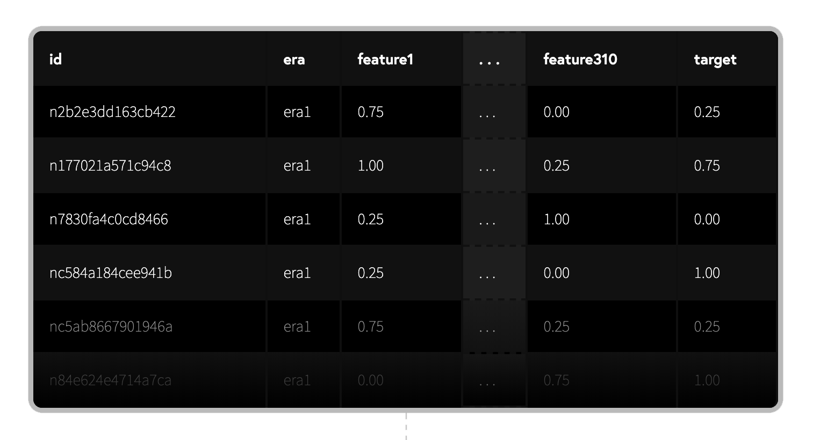
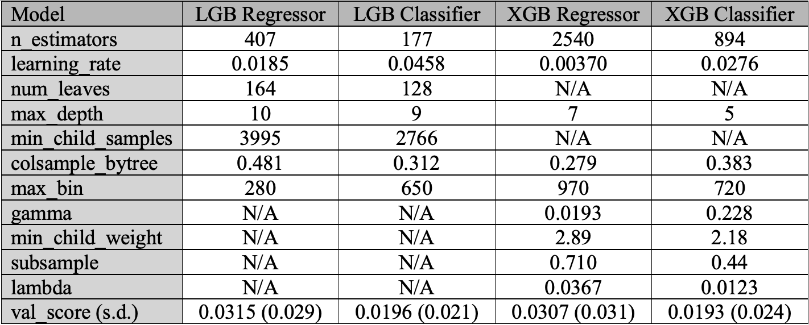

Jan 2020 - Oct 2021
# Numerai Submission


Numerai is a quant hedge fund that is built on thousands of crowdsourced ML models through the Numerai Tournament (https://numer.ai/tournament). Models can be staked with the NMR cryptocurrency to earn rewards. An open-source dataset is available for developing the model, while live data is posted weekly for participants to submit predictions. which are scored on their correlation with the ground-truth.

In this project, a Stacked Ensemble of Gradient Boosted Trees and Regression Models was developed for this challenge. They were trained on the 310 original features + engineered features, and they fed their predictions to a Meta-Estimator, which then produced a final prediction. The general architecture is shown below:


The Stacked Ensemble then competed from Nov 2020 to Oct 2021 for a total of 46 weeks. All models are ranked based on a 20-week moving average of their scores, and this model attained the following achievements:
```
Highest Ranking: 100 out of 3000+ staked models worldwide (Sept 2021)
Highest Correlation Score: 0.0732 (30 Jun 2021)
Cumulative Returns on NMR Stake: 238.7%
```
Refer to this README for a summary of the implementation, or view the notebooks for an in-depth description.

## Data Exploration



Each entry (id) in the obfuscated dataset represents a stock at a specific week (era), and the 310 features represent various quantitative attributes of the stock, while the target depicts its performance. The features and targets were only one of 5 discrete, normalized values: 0, 0.25, 0.5, 0.75 or 1.

The dataset was split into train (120 eras, 500K entries) and and validation (22 eras, 100K entries). To evaluate the performance of the trained model, correlation scores will be generated on each of the 22 eras in the validation set, before calculating the mean and standard deviation to determine the accuracy and consistency of the model.

## Baseline Model

Refer to the notebook "baseline_models.ipynb" for more details.

A simple XGBoost Model as a benchmark and had the following performance across 22 eras in the validation set:
```
Mean Correlation Score: 0.0260
Standard Deviation across Eras: 0.0307
```
As of Nov 2021, 0. 0260 is in the 76.3 percentile of all results, while 0.0300 is in the 98.3 percentile.

## Feature Engineering

Refer to the notebook "feature_engineering.ipynb" for more details on preparing the engineered features.

Additional features were added to the 310 original features by performing dimensionality reduction on the datasets with PCA and Autoencoding (with an ANN). Experiments with the baseline model showed that adding these additional information to the original features increases the performance noticably.

## Hyper-Parameter Tuning

Refer to the notebook "hyperparameter_tuning.ipynb" for more details.

The gradient boosted trees XGBoost and LightGBM each have more than 20 parameters that can be tuned, thus, hyper-parameter tuning was implemented on them using a Bayesian Optimisation Algorithm, which exponentially increases the speed of the hyper-parameter tuning. The best parameters obatined were as follows:



## Stacked Model Ensemble

Refer to the notebook "stacked_model_ensemble.ipynb" for more details.

Fitting an additional meta-model on top of the ensemble of models to best combine the predictions from each sub-model can improve performance. 10 different models were ensembled together to form a larger Stacked Model, which brought the following performance, above the 98.3 percentile:
```
Mean Correlation Score: 0.0302
Standard Deviation across Eras: 0.0307
```
## Live Results

Below shows the performance of the model on live data at the model's peak performance in June 2021 to Sep 2021. The ranking dropped off in Oct as I stopped submitting predictions.


Refer to the pdf file "Numerai Rounds.pdf" to view the performance of the model at each of the 46 rounds.
